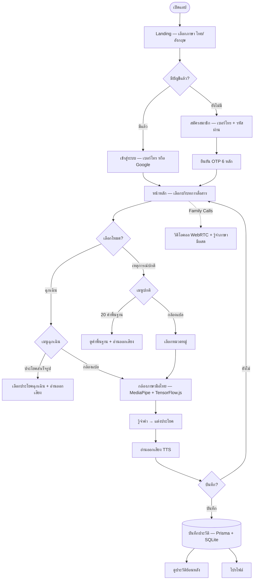
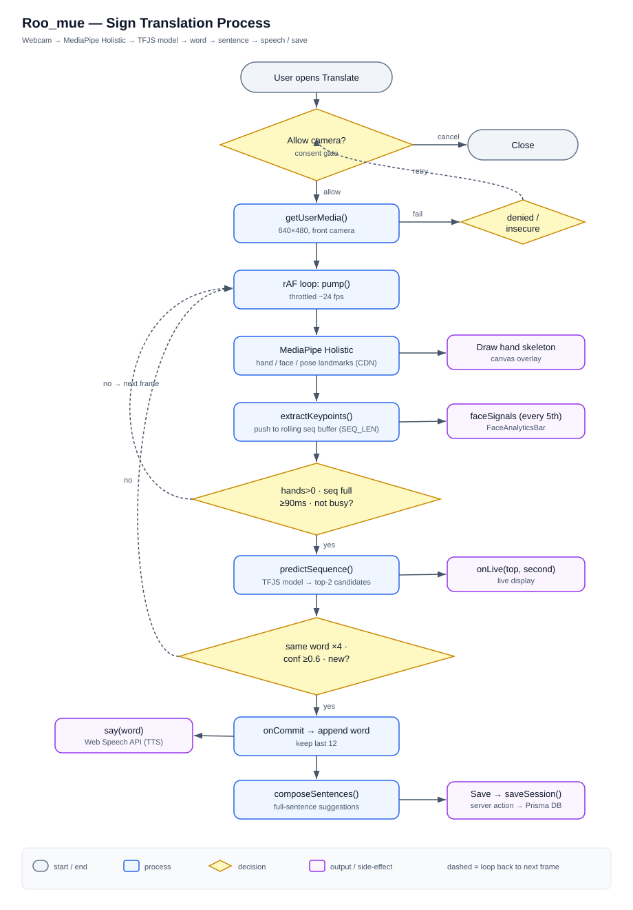
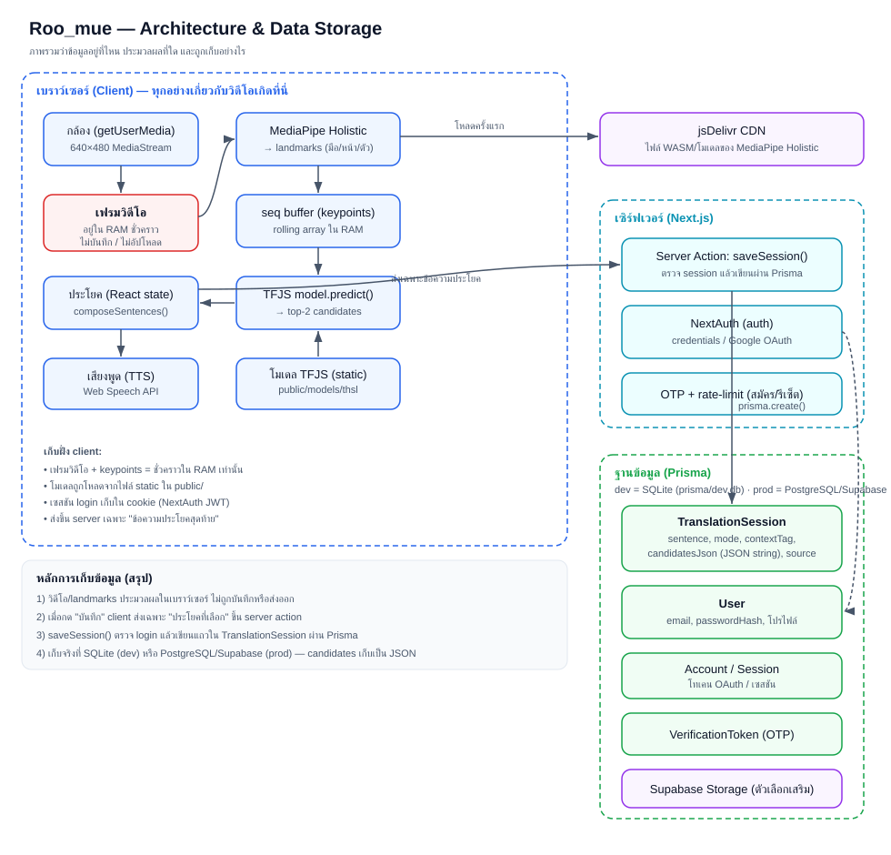

# Roo_mue

Roo_mue is a Next.js prototype for translating Thai Sign Language into Thai text. The app includes camera-based sign recognition, preset emergency phrases, daily-life sign references, translation history, authentication, and a basic call-room flow.

## What This Project Does

- Lets users sign in or register with email credentials.
- Opens a guided app flow for emergency or everyday communication.
- Uses the camera to detect signs, compose sentence suggestions, play speech output, and save translation sessions.
- Stores users and translation history with Prisma and SQLite for local development.
- Includes a TensorFlow.js model bundle in `public/models/thsl`.
- Supports Thai and English UI text through `next-intl`.

## Technology Stack

The stack is organized into the layers below.

### Frontend (web)
| Technology | Version | Role |
| --- | --- | --- |
| Next.js (App Router) | 14.2 | Full-stack React framework — routing, server actions, API routes |
| React / React DOM | 18.3 | UI rendering |
| TypeScript | 5.6 | Static typing across the codebase |
| Tailwind CSS (+ tailwindcss-animate) | 3.4 | Utility-first styling & animation |
| clsx · tailwind-merge · class-variance-authority | — | Class composition & variant management |
| lucide-react | 0.460 | Icon set |
| next-themes | 0.4 | Light / dark mode |
| next-intl | 3.26 | Thai / English i18n (`messages/`) |

### Backend, Auth & Data
| Technology | Version | Role |
| --- | --- | --- |
| NextAuth (`@next-auth/prisma-adapter`) | 4.24 | Authentication, optional Google OAuth, sessions |
| Prisma (`@prisma/client`) | 5.22 | ORM and schema management |
| SQLite (dev) / PostgreSQL · Supabase (prod) | — | Database |
| Supabase Storage | — | Session / history assets |
| `bcryptjs` | 2.4 | Password hashing |
| Custom OTP + rate limiting (`lib/otp.ts`, `lib/rate-limit.ts`) | — | Email verification, password reset, abuse protection |

### AI / Sign Recognition
| Technology | Version | Role |
| --- | --- | --- |
| @tensorflow/tfjs | 4.22 | In-browser Thai-sign model (`lib/translation/tfjs-client.ts`); bundle in `public/models/thsl` |
| @mediapipe/holistic | 0.5 | Hand / face / pose landmark tracking |
| @mediapipe/tasks-vision | 0.10 | Vision task inference |

### Real-Time Communication
| Technology | Role |
| --- | --- |
| WebRTC | Peer-to-peer call rooms (`lib/call/use-webrtc.ts`) |
| Server-Sent Events | Call signaling channel (`app/api/call/[room]/`) |
| Web Speech API | Speech recognition & text-to-speech (`lib/tts.ts`, `lib/call/use-speech-recognition.ts`) |

### Mobile app (`my-expo-app/`)
| Technology | Version | Role |
| --- | --- | --- |
| Expo (+ Expo Router) | SDK 56 | Cross-platform app framework & routing |
| React Native / React | 0.85 / 19.2 | Native UI runtime |
| react-native-reanimated · gesture-handler · worklets | 4.3 | Animation & gestures |

### Tooling
| Technology | Version | Role |
| --- | --- | --- |
| pnpm | 10.30 | Package manager |
| ESLint (`eslint-config-next`) | 8.57 | Linting |
| PostCSS + Autoprefixer | — | CSS pipeline |
| `tsc` | 5.6 | Type checking |

> **Note:** Thai sign recognition runs fully **in-browser** (TensorFlow.js + MediaPipe) — camera frames and keypoints never leave the device.

## How It Works

### User flow



### Recognition pipeline (process flow)

The camera-to-sentence flow runs entirely in the browser, with only the final
sentence sent to the server.



1. **Consent gate** — the camera never opens until the user taps "Allow"
   (`components/app/camera-translate.tsx`).
2. **Capture** — `getUserMedia()` opens a 640×480 front-camera stream; a
   `requestAnimationFrame` loop feeds frames to MediaPipe at ~24 fps.
3. **Landmarks** — MediaPipe Holistic extracts hand/face/pose keypoints, which
   are pushed into a rolling sequence buffer (`lib/holistic/keypoints.ts`).
4. **Inference** — when a hand is visible and the buffer is full, the TFJS model
   predicts the top-2 candidate words (`lib/translation/tfjs-client.ts`).
5. **Stability gate** — a word is committed only when the same prediction repeats
   4× in a row with confidence ≥ 0.6 (`lib/call/use-sign-recognition.ts`).
6. **Output** — committed words are spoken via the Web Speech API and composed
   into full-sentence suggestions (`lib/sentence/compose.ts`).

### Architecture & data storage



**Where the data lives and how it is stored:**

- **Video & landmarks — never stored.** Camera frames and extracted keypoints
  exist only in browser memory (RAM) during a session. They are not recorded,
  cached, or uploaded.
- **The ML model** is served as static files from `public/models/thsl/`, and
  MediaPipe's WASM/model files are loaded from a CDN on first use.
- **Login sessions** are kept in NextAuth cookies; account records live in the
  database (`User`, `Account`, `Session`, `VerificationToken`).
- **Only the final sentence is persisted.** When the user taps "Save", the
  client calls the `saveSession()` server action
  (`app/app/actions.ts`), which verifies the login and writes one
  `TranslationSession` row via Prisma. The stored fields are: `sentence`,
  `mode`, `contextTag`, `source`, and `candidatesJson` (the candidate list
  serialized as a JSON string) — see `prisma/schema.prisma`.
- **The database** is SQLite (`prisma/dev.db`) for local development and
  PostgreSQL / Supabase in production — the same Prisma schema works for both.

## Important Folders

- `app/` - Next.js routes, layouts, API routes, and server actions.
- `components/` - UI, auth, landing, and app-specific components.
- `lib/` - auth, database, translation, call, TTS, and utility logic.
- `messages/` - Thai and English translation files.
- `prisma/` - Prisma schema and local SQLite database.
- `public/models/thsl/` - TFJS model files and labels.
- `scripts/` - model training/conversion helpers.

## Local Setup

```bash
pnpm install
pnpm run db:generate
pnpm run dev
```

The development server starts at `http://localhost:3000` by default.

## Quality Checks

```bash
pnpm run lint
pnpm run typecheck
pnpm run build
```

## Environment

Copy `.env.example` to `.env` and set the values needed for your environment. For local development, the project is configured to use SQLite through `DATABASE_URL`.

Google sign-in is optional. It is enabled only when both `GOOGLE_CLIENT_ID` and `GOOGLE_CLIENT_SECRET` are present.

## Current Prototype Notes

- The Prisma schema is set up for SQLite locally. For production, switch the datasource provider to PostgreSQL and update `DATABASE_URL`.
- Email OTP generation is implemented, but real email delivery still needs a provider integration.
- The active translation entry point is in `lib/translation/index.ts`; camera recognition uses the TFJS/MediaPipe client pipeline.
