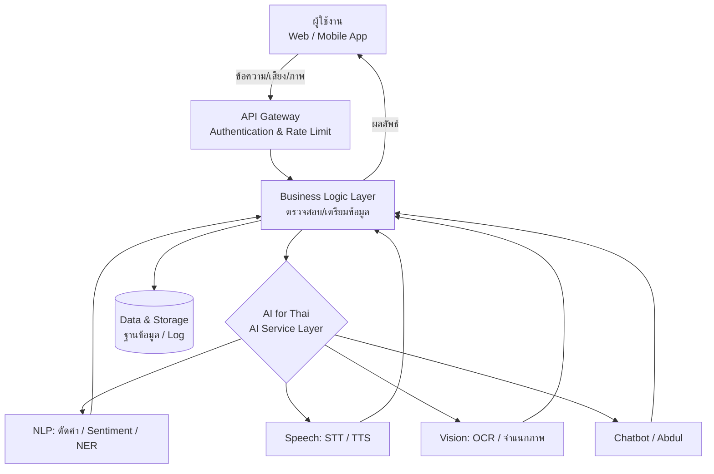

# รายงาน AI for Thai — Service Onboarding

> หมายเหตุ: เนื้อหานี้เป็นโครงร่างรายงาน ยังมีบางส่วนเป็นตัวอย่าง/placeholder
> โปรดปรับรายการโมเดล ชุดข้อมูล และ API ให้ตรงกับที่โครงการใช้จริงก่อนส่ง

---

## 1. สถาปัตยกรรมระบบเบื้องต้น (คำอธิบาย)

ระบบออกแบบเป็นสถาปัตยกรรมแบบ **หลายชั้น (Layered / Microservice-oriented Architecture)** โดยเรียกใช้บริการปัญญาประดิษฐ์ผ่าน **AI for Thai API** ของ NECTEC เป็นแกนหลักในการประมวลผลภาษาไทย ประกอบด้วยชั้นการทำงานหลัก 5 ชั้น ดังนี้

**1) ชั้นผู้ใช้งาน (Presentation / Client Layer)**
เป็นส่วนติดต่อผู้ใช้ (User Interface) ทั้งบนเว็บแอปพลิเคชันและอุปกรณ์เคลื่อนที่ รองรับการรับข้อมูลเข้าในรูปแบบข้อความ เสียง หรือรูปภาพ และแสดงผลลัพธ์ที่ได้จากการประมวลผลกลับสู่ผู้ใช้ ชั้นนี้ยังรองรับการเข้าถึงสำหรับผู้ใช้ทั่วไปและผู้พิการ (เช่น โหมดสำหรับผู้มีภาวะตาบอดสี และการปรับขนาดหน้าจอ)

**2) ชั้นเกตเวย์และการยืนยันตัวตน (API Gateway & Authentication Layer)**
ทำหน้าที่เป็นประตูทางเข้าเดียว (Single Entry Point) รับคำขอจากผู้ใช้ ตรวจสอบสิทธิ์การเข้าถึงด้วย API Key / Token ควบคุมอัตราการเรียกใช้ (Rate Limiting) และกระจายคำขอไปยังบริการปลายทางที่เกี่ยวข้อง เพื่อเพิ่มความปลอดภัยและลดภาระของระบบเบื้องหลัง

**3) ชั้นตรรกะทางธุรกิจ (Application / Business Logic Layer)**
เป็นสมองกลางที่จัดการเวิร์กโฟลว์ เช่น การตรวจสอบความถูกต้องของข้อมูลนำเข้า การจัดรูปแบบข้อมูลก่อนส่งเข้าโมเดล AI การรวมผลลัพธ์จากหลายบริการ และการจัดการเงื่อนไขทางธุรกิจต่าง ๆ

**4) ชั้นบริการปัญญาประดิษฐ์ (AI Service Layer – AI for Thai)**
เชื่อมต่อกับกลุ่มบริการของ AI for Thai ตามความต้องการใช้งาน เช่น
- **ด้านภาษา (NLP):** ตัดคำ (LexTo), วิเคราะห์ความรู้สึก (Sentiment), แยกชนิดคำ, การรู้จำชื่อเฉพาะ (NER)
- **ด้านเสียง (Speech):** แปลงเสียงเป็นข้อความ (Speech-to-Text / Partii), แปลงข้อความเป็นเสียง (Text-to-Speech / Vaja)
- **ด้านภาพ (Vision):** การรู้จำอักขระ (OCR), การจำแนกวัตถุ/ใบหน้า
- **ด้านการสนทนา (Chatbot):** ระบบผู้ช่วยตอบคำถามอัตโนมัติ (Abdul / Chatbot API)

**5) ชั้นข้อมูลและการจัดเก็บ (Data & Storage Layer)**
จัดเก็บข้อมูลผู้ใช้ ประวัติการใช้งาน บันทึกการทำงาน (Log) และแคชผลลัพธ์ โดยแยกฐานข้อมูลตามประเภทและระดับความอ่อนไหวของข้อมูล พร้อมมาตรการเข้ารหัสและสำรองข้อมูล

---

## 2. องค์ประกอบระบบและการไหลของข้อมูล (พร้อมแผนภาพ)

**การไหลของข้อมูล (Data Flow):** ผู้ใช้ส่งข้อมูล → API Gateway ตรวจสอบสิทธิ์ → Business Logic เตรียมข้อมูล → เรียก AI for Thai API ประมวลผล → รวบรวมและจัดรูปแบบผลลัพธ์ → ส่งกลับแสดงผลแก่ผู้ใช้ → บันทึก Log

**องค์ประกอบหลักของระบบโดยสรุป**

| องค์ประกอบ | หน้าที่ | เทคโนโลยี/บริการ |
|---|---|---|
| Client / UI | รับ-แสดงผลข้อมูล | Web, Mobile |
| API Gateway | ตรวจสอบสิทธิ์ ควบคุมการเข้าถึง | API Key / Token |
| Business Logic | จัดการเวิร์กโฟลว์และเงื่อนไข | Backend Service |
| AI Service | ประมวลผลภาษา/เสียง/ภาพไทย | AI for Thai API (NECTEC) |
| Data Storage | จัดเก็บและสำรองข้อมูล | Database + Encryption |

---

## 3. แนวทางการดูแลความปลอดภัย ความเป็นส่วนตัวของข้อมูล และการใช้ AI อย่างมีความรับผิดชอบ

### 3.1 ความปลอดภัยของระบบ (Security)
- เข้ารหัสข้อมูลระหว่างรับส่งด้วย **HTTPS/TLS** และเข้ารหัสข้อมูลขณะจัดเก็บ (Encryption at Rest)
- ยืนยันตัวตนและกำหนดสิทธิ์การเข้าถึงตามบทบาท (Authentication & Role-Based Access Control)
- ป้องกัน API ด้วย API Key, การจำกัดอัตราการเรียกใช้ (Rate Limiting) และการกรองข้อมูลนำเข้าเพื่อป้องกันการโจมตี (เช่น Injection)
- บันทึกและตรวจสอบการใช้งาน (Audit Log) เพื่อสืบหาความผิดปกติ พร้อมสำรองข้อมูลอย่างสม่ำเสมอ

### 3.2 ความเป็นส่วนตัวของข้อมูล (Data Privacy)
- ปฏิบัติตาม **พระราชบัญญัติคุ้มครองข้อมูลส่วนบุคคล (PDPA)** ของประเทศไทย
- เก็บข้อมูลเท่าที่จำเป็นต่อการให้บริการ (Data Minimization) และแจ้งวัตถุประสงค์การเก็บข้อมูลอย่างชัดเจน
- ขอความยินยอม (Consent) จากผู้ใช้ก่อนจัดเก็บหรือประมวลผลข้อมูลส่วนบุคคล
- ปกปิด/ลบข้อมูลระบุตัวตน (Anonymization / Data Masking) เมื่อไม่จำเป็น และกำหนดระยะเวลาจัดเก็บ พร้อมช่องทางให้ผู้ใช้ขอเข้าถึง แก้ไข หรือลบข้อมูลของตนได้

### 3.3 การใช้ AI อย่างมีความรับผิดชอบ (Responsible AI)
- **ความโปร่งใส (Transparency):** แจ้งให้ผู้ใช้ทราบว่ากำลังโต้ตอบกับระบบ AI และผลลัพธ์เป็นการประมวลผลอัตโนมัติ
- **ความเป็นธรรม (Fairness):** ตระหนักถึงอคติ (Bias) ที่อาจเกิดจากข้อมูลฝึกสอน และหลีกเลี่ยงการเลือกปฏิบัติ
- **การมีมนุษย์กำกับดูแล (Human Oversight):** ในการตัดสินใจที่มีผลกระทบสูง ควรมีมนุษย์ตรวจสอบก่อนนำผลลัพธ์ไปใช้ ไม่พึ่งพา AI เพียงลำพัง
- **ความรับผิดชอบ (Accountability):** กำหนดผู้รับผิดชอบและช่องทางร้องเรียนเมื่อระบบทำงานผิดพลาด
- ใช้ AI เพื่อสนับสนุนการทำงาน ไม่ใช้ในทางที่ก่อความเสียหายหรือละเมิดสิทธิผู้อื่น

---

## 4. ข้อจำกัดของระบบที่ผู้ใช้งานควรทราบ

1. **ความแม่นยำไม่ได้สมบูรณ์ 100%** – ผลลัพธ์จาก AI เป็นการประมาณค่าทางสถิติ อาจมีความคลาดเคลื่อน โดยเฉพาะกับข้อความกำกวม คำแสลง ภาษาถิ่น หรือคำทับศัพท์ ผู้ใช้ควรตรวจทานก่อนนำไปใช้จริง
2. **ขึ้นอยู่กับคุณภาพของข้อมูลนำเข้า** – เสียงที่มีสัญญาณรบกวน ภาพที่เบลอ/ความละเอียดต่ำ หรือข้อความที่พิมพ์ผิด จะทำให้ความแม่นยำลดลงอย่างมีนัยสำคัญ
3. **รองรับภาษาไทยเป็นหลัก** – ระบบออกแบบมาเพื่อภาษาไทย ประสิทธิภาพกับภาษาอื่นหรือเอกสารหลายภาษาปนกันอาจจำกัด
4. **การพึ่งพาบริการภายนอกและอินเทอร์เน็ต** – ต้องเชื่อมต่ออินเทอร์เน็ตและขึ้นอยู่กับความพร้อมของ AI for Thai API หากบริการต้นทางล่มหรือปรับเปลี่ยน อาจกระทบการทำงาน
5. **ข้อจำกัดด้านโควตาและปริมาณการใช้งาน** – มีการจำกัดจำนวนคำขอต่อช่วงเวลา (Rate Limit/Quota) และขนาดไฟล์ที่ประมวลผลได้ต่อครั้ง
6. **เวลาตอบสนอง (Latency)** – การประมวลผลเสียงหรือภาพขนาดใหญ่อาจใช้เวลาและมีความหน่วง ไม่เหมาะกับงานที่ต้องการผลลัพธ์แบบเรียลไทม์ทันทีในทุกกรณี
7. **ไม่ทดแทนการตัดสินใจของมนุษย์** – ผลลัพธ์ควรใช้เป็นข้อมูลประกอบการตัดสินใจ ไม่ควรใช้เป็นคำตัดสินสุดท้ายในเรื่องสำคัญ เช่น กฎหมาย การแพทย์ หรือการเงิน
8. **ความรู้ของโมเดลมีกรอบเวลา** – โมเดลเรียนรู้จากข้อมูลในอดีต อาจไม่ครอบคลุมคำศัพท์ เหตุการณ์ หรือบริบทใหม่ ๆ ที่เกิดขึ้นภายหลัง

---

## 5. แหล่งที่มาของโมเดล ชุดข้อมูล และ API ที่นำมาใช้

ระบบพัฒนาโดยใช้เทคโนโลยีปัญญาประดิษฐ์ด้านภาษาไทยจากหน่วยงานภายในประเทศเป็นแกนหลัก โดยมีแหล่งที่มาดังนี้

### 5.1 แหล่งที่มาของโมเดล (AI Models)

| โมเดล | ผู้พัฒนา/แหล่งที่มา | บทบาทในระบบ |
|---|---|---|
| Pathumma LLM | NECTEC (สวทช.) / โครงการ ThaiLLM | ประมวลผลและเข้าใจภาษาไทย (หากใช้) |
| โมเดลของ AI for Thai (LexTo, Sentiment, NER ฯลฯ) | NECTEC (สวทช.) | วิเคราะห์ภาษาไทย ตัดคำ จำแนกอารมณ์ |
| *(ถ้ามี) โมเดลต่างประเทศ เช่น GPT/Claude/Gemini* | OpenAI / Anthropic / Google | เสริมงานสรุปหรือจัดรูปแบบผลลัพธ์เท่านั้น |

### 5.2 แหล่งที่มาของชุดข้อมูล (Datasets)
- **ชุดข้อมูลภาษาไทยจาก AI for Thai / NECTEC** เช่น คลังคำศัพท์ พจนานุกรม และคลังข้อความภาษาไทย (Thai Corpus) ที่ใช้ในบริการตัดคำและวิเคราะห์ภาษา
- **ข้อมูลที่จัดเตรียมโดยทีมพัฒนา** ซึ่งเป็นข้อมูลภาษาไทยที่ผ่านการทำความสะอาดและปกปิดข้อมูลส่วนบุคคล (Anonymized) ตาม PDPA
- *(ระบุเพิ่มถ้ามี เช่น ข้อมูลสาธารณะ/Open Data ภาครัฐ, ชุดข้อมูลเฉพาะโดเมนของโครงการ)*

### 5.3 แหล่งที่มาของ API
- **AI for Thai API** — พัฒนาและให้บริการโดย **NECTEC สำนักงานพัฒนาวิทยาศาสตร์และเทคโนโลยีแห่งชาติ (สวทช.)**
  เว็บไซต์: https://aiforthai.in.th
  บริการที่เรียกใช้ (ระบุเฉพาะที่ใช้จริง): เช่น
  - `LexTo` — ตัดคำภาษาไทย
  - `Sentiment Analysis` — วิเคราะห์ความรู้สึก
  - `Partii` — แปลงเสียงเป็นข้อความ (Speech-to-Text)
  - `Vaja` — แปลงข้อความเป็นเสียง (Text-to-Speech)
  - `OCR` — รู้จำอักขระจากภาพ
  - `Abdul / Chatbot API` — ระบบสนทนาอัตโนมัติ
- *(ถ้ามี) API ต่างประเทศ* — ระบุชื่อและบทบาท เช่น "ใช้เสริมเฉพาะการสรุปข้อความ โดยการประมวลผลภาษาไทยหลักยังคงใช้ AI for Thai"

### 5.4 การอ้างอิงและสิทธิการใช้งาน
การเรียกใช้บริการทั้งหมดดำเนินการผ่าน **API Key ที่ลงทะเบียนอย่างถูกต้อง** กับแพลตฟอร์ม AI for Thai และปฏิบัติตามเงื่อนไขการให้บริการ (Terms of Service) ของผู้พัฒนาโมเดลและชุดข้อมูลแต่ละแหล่ง
